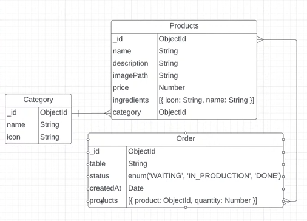

# Primeira Aula - API com Node.js e Typescript

## Configurações iniciais

"yarn init -y"
- Inicialização do projeto Node.js

"yarn add -D typescript"
- Instalação do typescript

"yarn tsc --init"
- gera arquivo de configuração tsconfig.json

Criar arquivo src/index.ts
- Testar se typescript está funcionando

"yarn tsc"
- Compila todos os arquivos .ts em .js
- Arquivos .js ficam na mesma pasta do .ts

Mudar "outDir" no tsconfig.json
- "outDIr": "dist"
- Os arquivos .js compilados vão para uma pasta dist

Fazer scripts no package.json
- build

Padronizando o código
- Instalar as extensões do vscode editorconfig e eslint

Configurando editorconfig
- Botão direito + Generate .editorconfig
- Configurar .editorconfig

Configurando eslint
- "npm init @eslint/config"

## Instalando express

"yarn add express"
- instala o express

Codar src/index.ts

## Instalando dependências adicionais

"yarn add -D ts-node"
- Dependência para rodar arquivos ts sem precisar buildar

"yarn ts-node src/index.ts"
- Roda o arquivo index.ts sem precisar buildar

"yarn add -D nodemon"
- Monitora alterações realizadas nos arquivos e restarta o server automaticamente

Criar o script "dev" no package.json
- "dev": "nodemon src/index.ts"
- nodemon vai trabalhar em conjunto com ts-node

## Banco de dados

Utilizaremos MongoDB
- Banco de dados NoSQL
- Possível instalar, utilizar online ou usar o Docker
- Utilizaremos o Docker

Docker
- Software de código aberto usado para implantar aplicativos dentro de containers virtuais
- Um container Docker é um pacote de software com todas as dependências necessárias para executar um aplicativo específico
- Um container é um ambiente isolado que roda qualquer código
- A conteinerização permite que vários aplicativos funcionem em diferentes ambientes complexos. Por exemplo: o Docker permite executar o WordPress em sistemas Windows, Linux e macOS
- Resumidamente, sobe um "novo" ambiente dentro do computador rodando o MongoDB

Mais info do Docker
- Ele possibilita o empacotamento de uma aplicação ou ambiente dentro de um container, se tornando portátil para qualquer outro host que contenha o Docker instalado. 
- Então, você consegue criar, implantar, copiar e migrar de um ambiente para outro com maior flexibilidade.
- https://www.hostinger.com.br/tutoriais/o-que-e-docker

Como rodar um container
- Pesquisar "docker" na search bar do docker e instalar a imagem
- "docker run --name mongo -p 27017:27017 -d mongo"

"yarn add mongoose"
- Pacote que lida com conexão e manipulação da base de dados
- atualizar index.ts para fazer com a conexão com o BD

Collections ("tabelas") e formato dos documents("registros") do BD
- Models é a representação que o mongoose dá para os Documents do BD
- Models (do mongoose) servem para fazer tipagem dos documentos
- Models promovem métodos para adicionar, deletar e alterar itens do BD

### Criando models

Criar diretório src/app/models

Criar arquivo src/app/models/Category.ts
- Codar esse arquivo

Criar arquivo src/app/models/Product.ts
- Codar esse arquivo